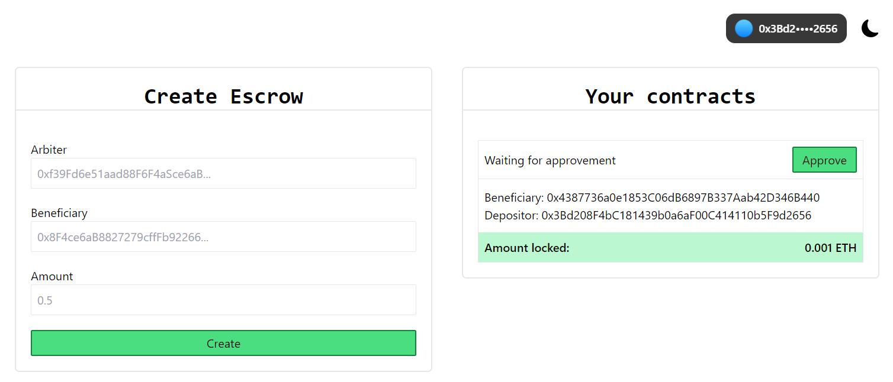

# Escrow DApp

This is a simple escrow DApp that allows two parties to create an escrow contract and deposit funds into it. When the contract is created a arbiter is provided and only this account can unlock the founds and send it to the beneficiary account.

